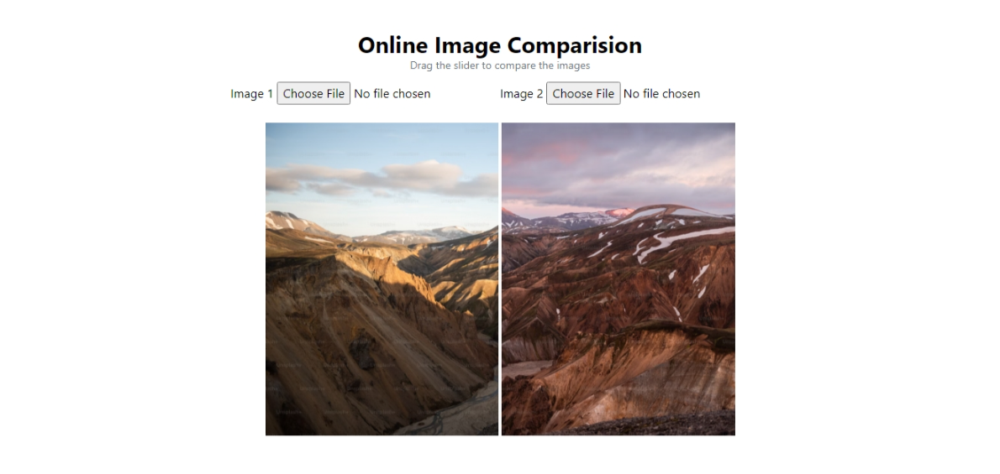

# image comparison using Vue 

This project is a simple image comparison tool using Vue 3 and Vite. It allows you to compare two images side by side and adjust the slider to see the differences between them. 


## Project Setup

### Clone the Repository

```sh
git clone https://github.com/AbdurRaahimm/image-comparison.git
```

### Change Directory

```sh 
cd image-comparison
```

### Install Dependencies

```sh
npm install
```

### Compile and Hot-Reload for Development

```sh
npm run dev
```

### Compile and Minify for Production

```sh
npm run build
```


## Features

-  Compare two images side by side
-  Adjust the slider to see the differences between the images 
-  Upload images from your local machine 

## Technologies Used

-  Vue 3
-  Vite
-  Tailwind CSS


## Live Demo 

[Live Demo](https://image-comparision.netlify.app/)

## Screenshot


## License

This project is open source and available under the [MIT License](LICENSE).


## Connect on Social Media
- [Twitter](https://twitter.com/AbdurRahim4G)
- [Instagram](https://www.instagram.com/abdurrahim4g/)
- [Facebook](https://www.facebook.com/Rahim72446)
- [LinkedIn](https://www.linkedin.com/in/abdur-rahim4g/)
- [YouTube](https://youtube.com/@AbdurRahimm)

